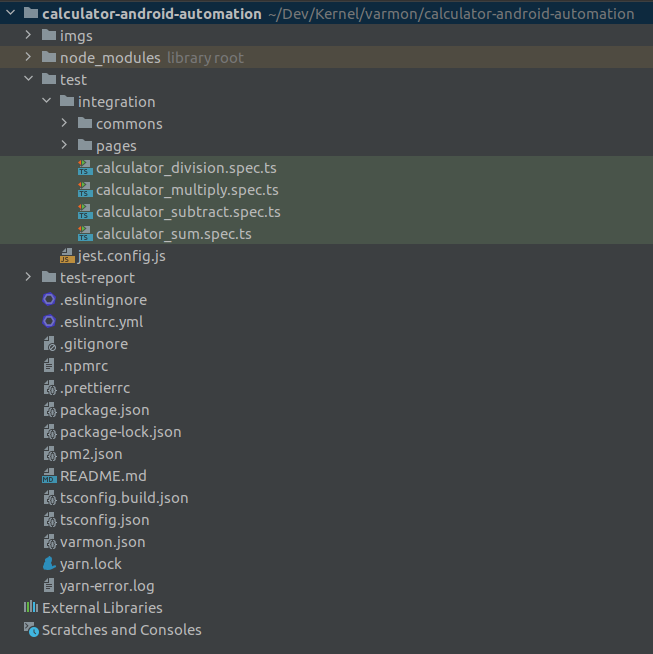
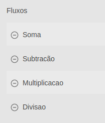
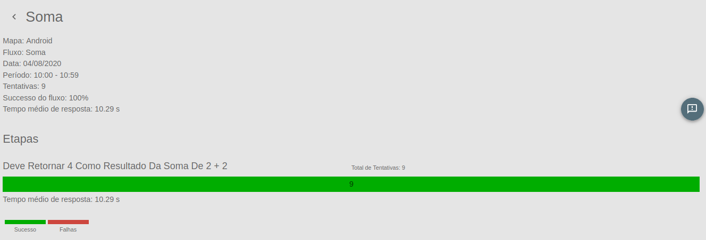
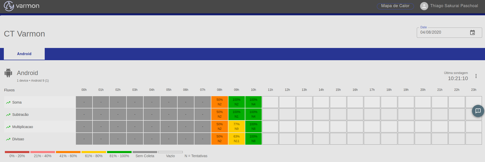

<div align="center">
  <h1>Varmon - Calculadora iOS</h1>
  <p>KonkerLabs</p>
</div>

#### Introdução

O Varmon disponibiliza uma API REST para o envio de dados que pode ser 
utilizada de qualquer liguagem de programação.  Além disso, disponibilizamos um SDK para uso com o 
Jest e o Appium que facilita bastante o envio dos dados e automatiza a captura de tela em caso de 
erros durante a automação.

#### O que significa Varmon?

O Varmon consiste em uma aplicação com objetivo de realizar a monitoração sintética da aplicação através de uma bateria de testes automatizados mobile.

#### Setup do ambiente de desenvolvimento dos testes automatizados iOS

Antes de iniciarmos o processo de desenvolvimento das automatizações, 
é necessário validar que temos o ambiente para desenvolvimento de testes automatizados mobile. 
Caso você não tenha, segue abaixo os aplicativos que devem ser instalados.

- Java 1.8

- Appium

Ah mas eu possuo Windows, como faz? Ah mas eu possuo Linux, MacOS?

Tranquilo, eu deixo alguns links que vão te guiar na configuracao do ambiente para os diferentes SOs.

https://www.guru99.com/introduction-to-appium.html

https://medium.com/brq-tech/appium-automa%C3%A7%C3%A3o-para-apps-mobile-6d43293d0cd8

#### Estrutura do projeto de automação

<div align="center">
  
</div>

Antes de descrever o que é cada arquivo que utilizamos no projeto, todos os testes são escritos 
em <a href="https://www.typescriptlang.org/docs/home.html">Typescript</a>. Usamos também 
algumas ferramentas de padronizacao de código como:
                                                                         
- <a href="https://github.com/typicode/husky">Husky</a>
- <a href="https://eslint.org/">ESLint</a>
- <a href="https://prettier.io/">Prettier</a>

#### Detalhando cada arquivo do projeto

###### 1. jest.config.js

~~~javascript
module.exports = {
    preset: "ts-jest",
    testRunner: "jest-circus/runner",
    testEnvironment: "../node_modules/varmon-jest/dist/JestEnvironment.js",
    reporters: [
        "default",
        "../node_modules/varmon-jest/dist/reporter/json-reporter.js",
    ],
    moduleNameMapper: {
        "^varmon-jest$": "varmon-jest/dist/utils/utils.js",
    },

    testEnvironmentOptions: {
        port: 4723,
        logLevel: "error",
        capabilities: {
            updatedWDABundleId: "br.com.inmetrics.varmon.WebDriverAgentRunner",
            platformName: "iOS",
            platformVersion: "13.6",
            deviceName: "<nome-do-device>",
            udid: "<udid>",
            app: "com.apple.calculator",
            automationName: "XCUITest",
            noReset: false,
            fullReset: false,
            newCommandTimeout: 180,
            autoAcceptAlerts: true

        },
    },
};
~~~

Campos   | Valor | Tipo | Descrição
--------- | ------ | ------ | ------
app | "com.apple.calculator" | string | Package da aplicação instalado.
platformName | IOS | string | Nome da plataforma, tipicamente "Android" ou "IOS"
platformVersion | 13.6 | string | Versão do sistema operacional da plataforma
deviceName | "nome-do-device" | string | Nome do dispositivo (deve ser único entre os dispositivos do mesmo mapa)
udid | "5758...416ccd" | string |identificador de dispositivo único

Os outros itens, você pode copiar do jeito que está sem problemas.
Caso deseje entender mais sobre todas as capabilities disponíveis você pode encontrar a informação em:

- <a href="http://appium.io/docs/en/writing-running-appium/caps/">capabilities</a>


Os campos acima, ***testRunner***, ***testEnvironment***, ***reporters***, ***moduleNameMapper***, são configurações padrões referentes a biblioteca ***varmon-jest***

##### varmon-jest - A cereja do bolo!!!

~~~javascript
"varmon-jest": "^1.0.6"
~~~

Ao abrir o package.json, você irá notar esta dependencia que é justamente a dependencia responsável por enviar os dados para a API Rest do Varmon.

##### Outros arquivos

Arquivo   | Descrição
--------- | ------
.eslintignore | Arquivos que não devem ser monitorados pelo ESLint
.eslintrc.yml | Arquivo de configuração automatizada para manter padrões de código (good-syntax) na aplicação
.gitignore | Arquivos que não devem ser versionados pelo git
.prettierc | Arquivo de configuração automatizada para manter code-style de acordo com linguagem usada na aplicação
.tsconfig.json | Arquivo de configuração Typescript
.tsconfig.build.json | Arquivo para distribuição no npm 

##### pm2.json

O varmon-jest possui um executável que possibilita a execução dos testes em loop. Este executavel nós configuramos dentro do arquivo pm2.json

~~~javascript
{
  "apps": [
    {
      "name": "calculator-ios-automation",
      "script": "./node_modules/.bin/varmon",
      "args" : "--projects test --detectOpenHandles"
    }
  ]
}
~~~

##### varmon.json

Neste arquivo nós informamos o nome dos fluxos (features) e a lista com o nome dos cenários das features que serão monitorados pela aplicacão. 

~~~javascript
{
    "apis": [
        {
            "url": "<endereco da API_REST>",
            "token": "<token>"
        }
    ],
    "flows": {
        "Soma": ["deve retornar 4 como resultado da soma de 2 + 2"],
        "Subtracão": ["deve retornar 2 como resultado da subtracao de 4 - 2"],
        "Multiplicacao": [
            "deve trazer 9 como resultado da multiplicacao de 3 x 3",
            "deve trazer 0 como resultado da multiplicacao de 2 x 0"
        ],
        "Divisao": [
            "deve trazer 5 como resultado da divisao de 15 por 3",
            "deve trazer a mensagem - 'Erro' quando houver uma divisao por zero"
        ]
    }
}
~~~

Dentro de ****flows**** temos o nome da feature e os cenários(lista) que compoẽm a feature. Para maiores detalhes de como isso é 
implementado basta verificar o diretório ****src/integration**** e ****src/integration/pages****.

****src/integration****

~~~typescript
calculator_sum.spec.ts

import {sumSpec} from "./pages/sum";

describe("Soma", function() { /* nome da feature */
    beforeEach(async () => {
        const wait = 1250;
        await browser.pause(wait);
    }); /* antes de cada cenário execute estes passos */
    sumSpec();
});
~~~

****src/integration/pages****

~~~typescript
sum.ts

export function sumSpec() {
  describe("Soma", function() { /* nome da feature */
    it("deve retornar 4 como resultado da soma de 2 + 2", sumStep); /* nome do cenário */
  });
}
~~~

Toda vez que um fluxo for iniciado, ele vai começar 
à transitar entre várias telas. Esse código vai pegar o resultado de cada teste de tela (se foi sucesso ou falha) 
e enviar ao Varmon para ser apresentado desta forma:



Agora, temos o detalhe da feature já com nome do cenário. Legal né? Note que o nome da feature e dos cenários é exatamento o mesmo nome do que está cadastrado no código do teste



##### Token do mapa

Os dados de automação precisam ser enviados para um mapa do varmon.  Aplicações tipicamente possuem 2 mapas, um para IOS e um para Android.  O mesmo script de automação pode ser executado em vários dispositivos diferentes (de diferentes modelos ou versões) e ter os dados de todos os dispositivos enviados para o mesmo mapa. 

Cada mapa possui um token de acesso.  Para enviar dados pela API REST ou pelo SDK, você vai precisar ter esse token de acesso em mãos. 

#### Instalando as dependências

Uffa, falei bastante né? Agora vamos estruturar o nosso projeto

Para instalar as dependências do projeto, basta executar um destes comandos abaixo dentro da pasta-raiz do seu projeto e de preferência no terminal

```
npm i (Para instalar usando o gerenciador de pacotes Node)
```

ou

```
yarn (Para instalar usando o Yarn)
```

#### Rodando o projeto!!!

Para rodar o projeto é muito simples. Basta apenas executar o comando, localizado no seu package.json.

```
npm run test (Para executar os testes usando o gerenciador de pacotes Node)
```

ou

```
yarn test (Para executar os testes usando o Yarn)
```

#### Heatmap

<div align="center">
  
</div>